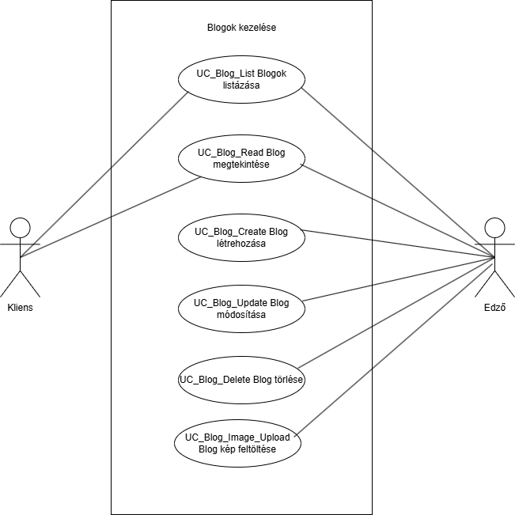

= Blogok kezelése - Funkcionális modell

== Leírás

A rendszer lehetővé teszi a blogok kezelését.

== Használati esetek

=== Használati eset diagram

=== Használati esetek rövid leírása

=== Blogok listázása
[cols="1h,3"]
|===
| Azonosító
| UC_Blog_List

| Kiváltó esemény
| A felhasználó a blogok listáját szeretné megtekinteni.

| Felhasználók
| Kliens, Edző

| Elsődleges lefutás
|
1. A felhasználó rákattint a "Blogok listázása" gombra.

2. A rendszer lekérdezi az összes blogot és megjeleníti a listát.

| Kivételek és alternatívák
| - Ha nincs elérhető blog, a rendszer üres listát ad vissza.

| Utófeltétel
| A rendszer megjeleníti a blogok listáját.

| Eredmény
| A felhasználó látja a blogok listáját.

| Használati eset realizáció
| Technikai modell
|===

=== Blog megtekintése
[cols="1h,3"]
|===
| Azonosító
| UC_Blog_Read

| Kiváltó esemény
| A felhasználó meg szeretné tekinteni egy blog adatait.

| Felhasználók
| Kliens, Edző

| Elsődleges lefutás
|
1. A felhasználó kiválaszt egy blogot a listából.

2. A rendszer lekérdezi és megjeleníti a blog részletes adatait.

| Kivételek és alternatívák
| -

| Utófeltétel
| A blog részletes adatai megjelennek a felületen.

| Eredmény
| A felhasználó látja a blog adatokat.

| Használati eset realizáció
| Technikai modell
|===

=== Blog létrehozása
[cols="1h,3"]
|===
| Azonosító
| UC_Blog_Create

| Kiváltó esemény
| A felhasználó új blogot kíván létrehozni.

| Felhasználók
| Edző

| Elsődleges lefutás
|
1. A felhasználó megadja a blog adatokat.

2. A rendszer érvényesíti az adatokat.

3. A blog adatainak mentése az adatbázisba.

| Kivételek és alternatívák
| - Hibás adatbevitel esetén hibaüzenet jelenik meg.

| Utófeltétel
| Az új blog sikeresen létrejön.

| Eredmény
| A felhasználó látja az új blogot.

| Használati eset realizáció
| Technikai modell
|===

=== Blog módosítása
[cols="1h,3"]
|===
| Azonosító
| UC_Blog_Update

| Kiváltó esemény
| A felhasználó módosítani kívánja a blogot.

| Felhasználók
| Edző

| Elsődleges lefutás
|
1. A felhasználó kiválasztja a módosítani kívánt blogot.

2. A rendszer érvényesíti az új adatokat.

3. A blog adatainak frissítése az adatbázisban.

| Kivételek és alternatívák
| - Hibás adatbevitel esetén hibaüzenet jelenik meg.

| Utófeltétel
| A blog adatai frissültek.

| Eredmény
| A felhasználó látja a módosított adatokat.

| Használati eset realizáció
| Technikai modell
|===

=== Blog törlése
[cols="1h,3"]
|===
| Azonosító
| UC_Blog_Delete

| Kiváltó esemény
| A felhasználó törölni kíván egy blogot.

| Felhasználók
| Admin, Edző

| Elsődleges lefutás
|
1. A felhasználó kiválasztja a törölni kívánt blogot.

2. A rendszer törli a blogot az adatbázisból.

| Kivételek és alternatívák
| - Ha a blog nem található, hibaüzenet jelenik meg.

| Utófeltétel
| A blog törlésre került.

| Eredmény
| A felhasználó látja a sikeres törlés visszaigazolását.

| Használati eset realizáció
| Technikai modell
|===

=== Blog kép feltöltése
[cols="1h,3"]
|===
| Azonosító
| UC_Blog_Image_Upload

| Kiváltó esemény
| A felhasználó képet kíván feltölteni egy bloghoz.

| Felhasználók
| Edző

| Elsődleges lefutás
|
1. A felhasználó kiválasztja a képet.

2. A rendszer feltölti a képet és társítja a bloghoz.

| Kivételek és alternatívák
| - Hibás fájlformátum vagy túl nagy fájl esetén hibaüzenet jelenik meg.

| Utófeltétel
| A blog profilképe frissül.

| Eredmény
| A felhasználó látja a feltöltött képet.

| Használati eset realizáció
| Technikai modell
|===

== Jogosultságok
[cols="1,1,1"]
|===
|Használati eset| Jogosultság| Szerepkörök

| Blogok listázása| BLOG_LIST| Kliens, Edző
| Blog megtekintése| BLOG_READ| Kliens, Edző
| Blog létrehozása| CREATE_BLOG| Edző
| Blog törlése| DELETE_BLOG| Admin
| Blog módosítása| UPDATE_BLOG| Admin, Edző
| Blog kép feltöltése| UPLOAD_BLOG_IMAGE| Edző
|===

== Felületi terv

=== Blogok listázása felület

==== A felületen lévő mezők

[cols="1,1,1,1,1"]
|===
|Név |Típus |Kötelező?| Szerkeszthető?| Megjelenés

|Cím |Header oszlopcím| I| N| Találati lista
|Edző |Header oszlopcím| I| N| Találati lista
|Fejléc szöveg |Header oszlopcím| I| N| Találati lista
|===

==== A felületről elérhető műveletek
[cols="1,1,1"]
|===
|Esemény |Leírás | Jogosultság

|Blogok listázása gombra kattintás |Megjelennek a blogok.| BLOG_LIST
|===

=== Blog megtekintése felület

==== A felületen lévő mezők

[cols="1,1,1,1,1"]
|===
|Név |Típus |Kötelező?| Szerkeszthető?| Megjelenés

|Cím |Text| I| N| Kiválasztott blog
|Edző |Text| I| N| Kiválasztott blog
|Fejléc szöveg |Text| I| N| Kiválasztott blog
|Fő szöveg |Text| I| N| Kiválasztott blog
|Kép |Kép| N| N| Megjelenik, ha van
|===

==== A felületről elérhető műveletek
[cols="1,1,1"]
|===
|Esemény |Leírás | Jogosultság

|Blog megtekintése gombra kattintás |A blog részletes adatainak megjelenítése.| BLOG_READ
|===

=== Blog szerkesztése felület

==== A felületről elérhető műveletek
[cols="1,1,1,1"]
|===
|Esemény |Leírás | Felület| Jogosultság

|Mentés gomb |A blog adatainak mentése.| Szerkesztő nézet| UPDATE_BLOG
|===

=== Blog törlése felület

==== A felületről elérhető műveletek
[cols="1,1,1"]
|===
|Esemény |Leírás | Jogosultság

|Blog törlése gomb |A rendszer törli a kiválasztott blogot.| DELETE_BLOG
|===

=== Blog létrehozása felület

==== A felületen lévő mezők

[cols="1,1,1,1,1"]
|===
|Név |Típus |Kötelező?| Szerkeszthető?| Megjelenés

|Cím |Text| I| I| Beviteli mező
|Edző |Kiválasztó| I| I| Kiválasztás egy létező edzőből
|Fejléc szöveg |Text| I| I| Beviteli mező
|Fő szöveg |Text| I| I| Beviteli mező
|Kép |Fájl| N| I| Kép feltöltése (opcionális)
|===

==== A felületről elérhető műveletek
[cols="1,1,1"]
|===
|Esemény |Leírás | Jogosultság

|Blog létrehozása gombra kattintás |Új blog létrehozása a megadott adatokkal.| CREATE_BLOG
|===

link:../functional-models.adoc[Vissza]