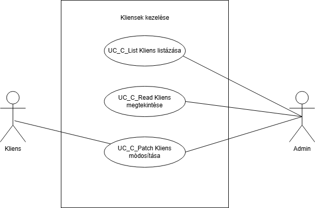
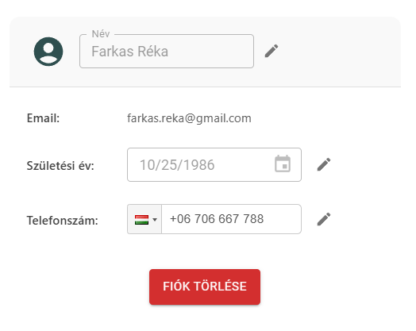

= Kliensek kezelése - Funkcionális modell

== Leírás

A rendszer lehetővé teszi a kliensek kezelését.

== Használati esetek

=== Használati eset diagram

=== Használati esetek rövid leírása

==== Kliensek listázása
[cols="1h,3"]
|===

| Azonosító
| UC_C_List

| Kiváltó esemény
| A felhasználó listázni kívánja a klienseket.

| Felhasználók
| Kliens, Edző

| Elsődleges lefutás
|
1. A felhasználó a "Kliensek listázása" menüpontra kattint.

2. A rendszer lekérdezi az összes kliens adatait, beleértve a név, születési dátum, nem, telefonszám, és login információkat.

| Kivételek és alternatívák
| - Ha nincs elérhető kliens, a rendszer egy üres listát ad vissza.

| Utófeltétel
| A rendszer az összes kliens adatát megjeleníti.

| Eredmény
| A felhasználó látja a kliensek listáját.

| Használati eset realizáció
| Technikai modell
|===

==== Kliens megtekintése
[cols="1h,3"]
|===

| Azonosító
| UC_C_Read

| Kiváltó esemény
| A felhasználó megkívánja tekinteni a kiválasztott kliens adatait.

| Felhasználók
| Kliens

| Elsődleges lefutás
|
1. A felhasználó kiválasztja a klienst.

2. A rendszerben lekérdezésre kerül a kiválasztott kliens.

| Kivételek és alternatívák
| -

|Utófeltétel
|A rendszerben a kliens lekérdezésre került.

| Eredmény
| A felhasználó látja a kiválasztott kliens metaadatait.

| Használati eset realizáció
| Technikai modell

|===

==== Kliens módosítása
[cols="1h,3"]
|===

| Azonosító
| UC_C_Patch

| Kiváltó esemény
| A felhasználó módosítani kívánja a kiválasztott kliens metaadatát.

| Felhasználók
| Kliens

| Elsődleges lefutás

|
1. A felhasználó kiválasztja a módosítani kívánt adatot (pl. név, születési dátum, telefonszám).

2. A felhasználó elindítja a módosítást.

3. A rendszer módosítja a kliens adatot az adatbázisban.

|Kivételek és alternatívák
| - Ha az adat érvénytelen, az alkalmazás hibát jelez (például érvénytelen telefonszám formátum).

- A kiválasztott adat nem változtatható, ha nincs megfelelő jogosultság.

| Utófeltétel
| A kliens adatai frissültek az adatbázisban.

| Eredmény
| A felhasználó látja a módosított kliens metaadatait.

| Használati eset realizáció
| Technikai modell

|===

== Jogosultságok

[cols="1,1,1"]
|===
|Használati eset| Jogosultság| Szerepkörök

| Kliens listázása| CLIENT_LIST| Admin
| Kliens megtekintése| CLIENT_READ| Admin
| Kliens módosítása| CLIENT_PATCH| Kliens, Admin
|===

== Felületi terv

=== Kliens szerkesztése felület

==== A felületen lévő mezők

[cols="1,1,1,1,1"]
|===
|Név |Típus |Kötelező?| Szerkeszthető?| Validáció

|Név |Szöveges input mező| I| I| Minimum 2, maximum 50 karakterből álljon
|Születési dátum |Dátum input mező| I| I|
|Nem |Választó gomb| I| N| Felvehető értékek: ["Male","Female","Other"]
|Telefonszám | Szöveges input mező| I| I|

|===

==== A felületről elérhető műveletek

[cols="1,1,1,1"]
|===
|Esemény |Leírás | Felület|Jogosultság

|A "Mentés" gombra kattintás|
Végrehajtásra kerül a Kliens módosítása használati eset. A felhasználó adatai frissülnek.

A gomb mindaddig DISABLED amíg az űrlap nem valid.
| Kliens módosítása felület
| CLIENT_PATCH

|===

=== Kliens megtekintése felület

==== A felületen lévő mezők

[cols="1,1,1,1,1"]
|===
|Név |Típus |Kötelező?| Szerkeszthető?| Validáció
|Név |Header oszlopcím| I| I| Minimum 2, maximum 50 karakterből álljon
|Születési dátum |Header oszlopcím| I| I|
|Nem |Header oszlopcím| I| N| Felvehető értékek: ["Male","Female","Other"]
|Telefonszám | Header oszlopcím| I| I|

|===

==== A felületről elérhető műveletek

[cols="1,1,1"]
|===
|Esemény |Leírás |Jogosultság

|A "Profil" gombra kattintás|
Végrehajtásra kerül a Kliens megtekintése használati eset. A felhasználó adatai megjelennek.

| CLIENT_READ

|===

link:../functional-models.adoc[Vissza]