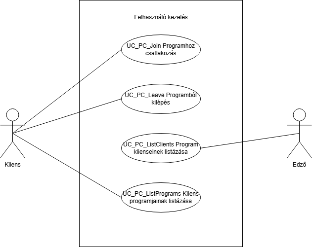

= Program-Client kapcsolat kezelése - Funkcionális modell

== Leírás
A rendszer lehetővé teszi programok és kliensek közötti kapcsolatok kezelését.

== Használati esetek

=== Használati eset diagram

=== Programhoz csatlakozás Kliensként
[cols="1h,3"]
|===
| Azonosító | UC_PC_Join
| Kiváltó esemény | A kliens csatlakozik egy programhoz
| Felhasználók | Kliens
| Elsődleges lefutás
|
1. A kliens rányom a "Jelentkezés" gombra

2. A rendszer létrehozza a kapcsolatot
| Eredmény | A Kliens hozzáadásra kerül a programhoz
|===

=== Kliens eltávolítása programról
[cols="1h,3"]
|===
| Azonosító | UC_PC_Leave
| Kiváltó esemény | A kliens kilép egy programból
| Felhasználók | Kliens
| Elsődleges lefutás | 1. A kliens rányom a "Lemondás" gombra

 2. A rendszer törli a kapcsolatot
| Eredmény | A Kliens eltávolításra kerül a programról
|===

=== Programra jelentkezett kliensek listázása
[cols="1h,3"]
|===
| Azonosító | UC_PC_ListClients
| Kiváltó esemény | Admin vagy edző megtekinti a programra jelentkezett klienseket
| Felhasználók | Admin, Edző
| Elsődleges lefutás | 1. A felhasználó kiválasztja a programot

2. A rendszer megjeleníti a kliens listát
| Eredmény | A programhoz tartozó kliens lista megjelenik
|===

=== Kliens programjainak listázása
[cols="1h,3"]
|===
| Azonosító | UC_PC_ListPrograms
| Kiváltó esemény | Admin vagy kliens megtekinti a kliens programjait
| Felhasználók | Admin, Kliens
| Elsődleges lefutás | 1. A felhasználó kiválasztja a klienst

2. A rendszer megjeleníti a program listát
| Eredmény | A klienshez tartozó program lista megjelenik
|===

=== Programra jelentkezett kliensek számának lekérdezése
[cols="1h,3"]
|===
| Azonosító | UC_PC_CountClients
| Kiváltó esemény | Bárki lekérdezi a programra jelentkezett kliensek számát
| Felhasználók | Mindenki
| Elsődleges lefutás | 1. A felhasználó kiválasztja a programot

2. A rendszer visszaadja a résztvevők számát
| Eredmény | A programra jelentkezett kliensek száma megjelenik
|===

=== Kliens programjainak számának lekérdezése
[cols="1h,3"]
|===
| Azonosító | UC_PC_CountPrograms
| Kiváltó esemény | Bárki lekérdezi a kliens programjainak számát
| Felhasználók | Mindenki
| Elsődleges lefutás | 1. A felhasználó kiválasztja a klienst

2. A rendszer visszaadja a programok számát
| Eredmény | A Kliens programjainak száma megjelenik
|===

=== Résztvétel ellenőrzése
[cols="1h,3"]
|===
| Azonosító | UC_PC_CheckAttendance
| Kiváltó esemény | Bárki ellenőrzi, volt-e már a kliens a programon
| Felhasználók | Mindenki
| Elsődleges lefutás | 1. A felhasználó kiválasztja a klienst és a programot

2. A rendszer visszaadja a kapcsolat állapotát
| Eredmény | Megjelenik, hogy a kliens részt vett-e a programon
|===

== Jogosultságok
[cols="1,1,1"]
|===
| Használati eset | Jogosultság | Szerepkörök
| Kliens felvétele programra | JOIN_PROGRAM | Kliens
| Kliens eltávolítása programról | LEAVE_PROGRAM | Kliens
| Programra jelentkezett kliensek listázása | LIST_PROGRAMS_CLIENTS | Admin, Edző
| Kliens programjainak listázása | LIST_CLIENTS_PROGRAMS | Admin, Kliens
|===

== Felületi terv

=== Program-Kliens kapcsolat kezelése
[cols="1,1,1"]
|===
| Mező | Típus | Kötelező
| Program azonosító | Száminput | Igen
| Kliens azonosító | Száminput | Igen
|===

link:../functional-models.adoc[Vissza]