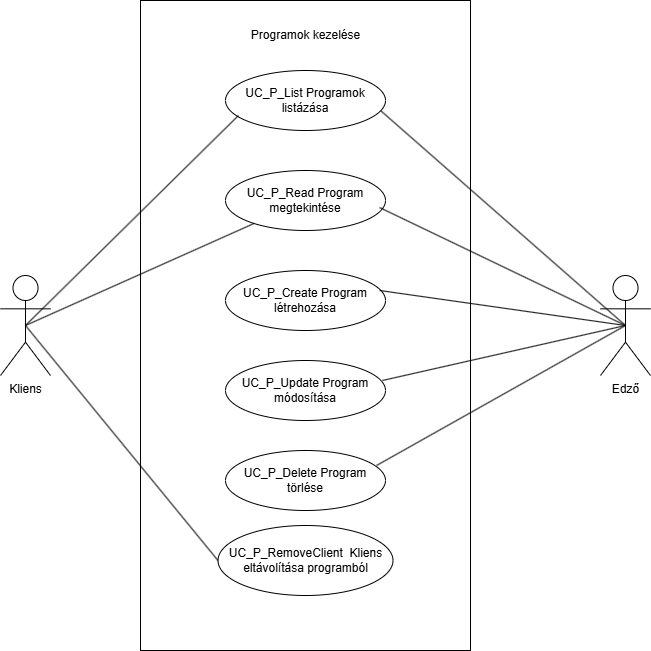
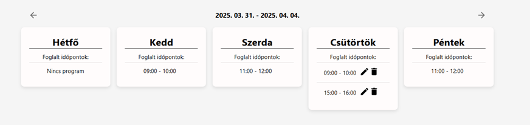
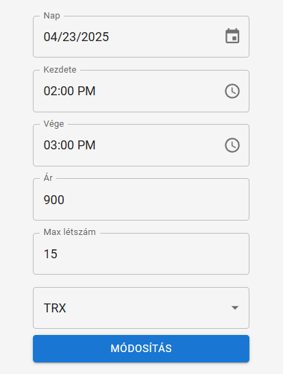
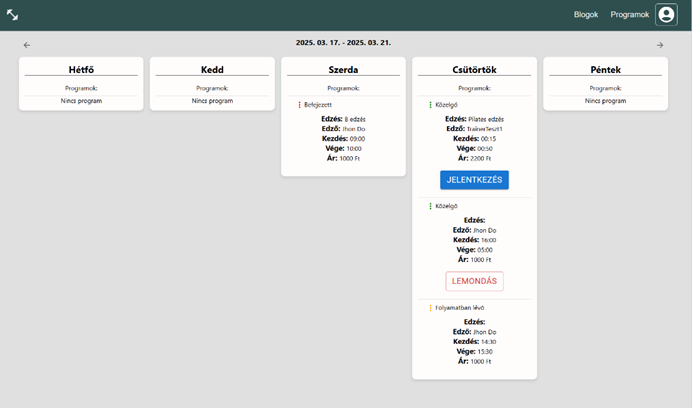
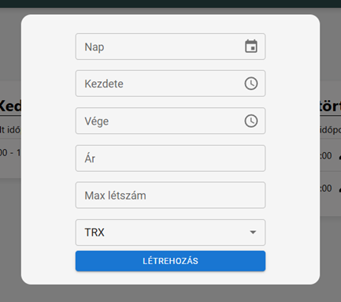

= Programok kezelése - Funkcionális modell

== Leírás

A rendszer lehetővé teszi a programok kezelését.

== Használati esetek

=== Használati eset diagram

=== Használati esetek rövid leírása

==== Programok listázása
[cols="1h,3"]
|===
| Azonosító
| UC_P_List

| Kiváltó esemény
| A felhasználó listázni kívánja az elérhető edzésprogramokat.

| Felhasználók
| Edző, Kliens

| Elsődleges lefutás
|

A felhasználó a "Programok" menüpontra kattint.

A rendszer lekérdezi és visszaadja az összes elérhető program alapadatait.

| Kivételek és alternatívák
| - Nincs elérhető program: üres lista jelenik meg.

| Utófeltétel
| A programok listája megjelenik.

| Eredmény
| A felhasználó látja az edzésprogramokat.

| Használati eset realizáció
| Technikai modell
|===

==== Program megtekintése
[cols="1h,3"]
|===
| Azonosító
| UC_P_Read

| Kiváltó esemény
| A felhasználó egy program részletes adataira kíváncsi.

| Felhasználók
| Edző, Kliens

| Elsődleges lefutás
|

A felhasználó kiválaszt egy programot.

A rendszer lekérdezi és megjeleníti a részletes adatokat.

| Kivételek és alternatívák
| - Nem létező program: hibaüzenet jelenik meg.

| Utófeltétel
| A kiválasztott program részletes adatai megjelennek.

| Eredmény
| A felhasználó megtekinti a program részleteit.

| Használati eset realizáció
| Technikai modell
|===

==== Program létrehozása
[cols="1h,3"]
|===
| Azonosító
| UC_P_Create

| Kiváltó esemény
| A felhasználó új edzésprogramot kíván létrehozni.

| Felhasználók
| Edző

| Elsődleges lefutás
|

A felhasználó megadja a program adatait.

A rendszer validálja az adatokat.

Az új program mentésre kerül.

| Kivételek és alternatívák
| - Hibás adatbevitel: validációs hiba.

  - Nem létező edző azonosító: hibaüzenet.

| Utófeltétel
| A program bekerült az adatbázisba.

| Eredmény
| A program elérhető lesz a felületen.

| Használati eset realizáció
| Technikai modell
|===

==== Program módosítása
[cols="1h,3"]
|===
| Azonosító
| UC_P_Update

| Kiváltó esemény
| A felhasználó módosítani kívánja a program adatait.

| Felhasználók
| Edző

| Elsődleges lefutás
|

Az edző kiválaszt egy programot.

Módosítja a kívánt mezőket.

A rendszer validálja és frissíti az adatokat.

| Kivételek és alternatívák
| - Érvénytelen dátum: hibaüzenet.

  - Nem létező program vagy edző: hibaüzenet.

| Utófeltétel
| A módosított program elmentésre kerül.

| Eredmény
| A felhasználók az új adatokat látják.

| Használati eset realizáció
| Technikai modell
|===

==== Program törlése
[cols="1h,3"]
|===
| Azonosító
| UC_P_Delete

| Kiváltó esemény
| A felhasználó törölni kíván egy programot.

| Felhasználók
| Admin, Edző

| Elsődleges lefutás
|

A felhasználó kiválasztja a törlendő programot.

A rendszer megerősítést kérhet.

A program törlésre kerül.

| Kivételek és alternatívák
| - Nem létező program: hibaüzenet.

| Utófeltétel
| A program törölve lett.

| Eredmény
| A törölt program többé nem elérhető.

| Használati eset realizáció
| Technikai modell
|===

==== Kliensek hozzárendelése programhoz
[cols="1h,3"]
|===
| Azonosító
| UC_P_AddClient

| Kiváltó esemény
| A felhasználó hozzárendeli a klienst egy programhoz.

| Felhasználók
| Kliens

| Elsődleges lefutás
|

A felhasználó kiválasztja a klienst és a programot.

A hozzárendelés megtörténik.

| Kivételek és alternatívák
| - Nem létező program vagy kliens: hibaüzenet.

| Utófeltétel
| A kliens bekerül a program résztvevői közé.

| Eredmény
| A kliens részt vesz a programban.

| Használati eset realizáció
| Technikai modell
|===

==== Programból kliens eltávolítása
[cols="1h,3"]
|===
| Azonosító
| UC_P_RemoveClient

| Kiváltó esemény
| A felhasználó eltávolít egy klienst egy programból.

| Felhasználók
| Admin, Kliens

| Elsődleges lefutás
|

A felhasználó kiválasztja a klienst és a programot.

A kliens eltávolításra kerül a programból.

| Kivételek és alternatívák
| - Nem létező program vagy kliens: hibaüzenet.

| Utófeltétel
| A kliens már nem része a programnak.

| Eredmény
| A kliens törlésre kerül a programból.

| Használati eset realizáció
| Technikai modell
|===

==== Kliens volt-e programon
[cols="1h,3"]
|===
| Azonosító
| UC_P_WasOnProgram

| Kiváltó esemény
| A rendszer ellenőrzi, hogy a kliens részt vett-e egy adott programon.

| Felhasználók
| Admin, Kliens

| Elsődleges lefutás
|

A rendszer lekérdezi a kliens programlistáját.

Megvizsgálja, szerepel-e benne a megadott program.

| Kivételek és alternatívák
| - Nem létező program vagy kliens: hibaüzenet.

| Utófeltétel
| Az eredmény visszaadásra kerül.

| Eredmény
| A rendszer válaszol, hogy a kliens részt vett-e a programon.

| Használati eset realizáció
| Technikai modell
|===

== Jogosultságok

[cols="1,1,1"]
|===
|Használati eset| Jogosultság| Szerepkörök

| Programok listázása| PROGRAM_LIST| Kliens, Edző
| Program megtekintése| PROGRAM_READ| Kliens, Edző
| Program létrehozása| CREATE_PROGRAM| Edző
| Program módosítása| UPDATE_PROGRAM| Edző
| Program törlése| DELETE_PROGRAM| Admin, Edző
| Kliensek hozzárendelése| ADD_CLIENT_TO_PROGRAM| Kliens
| Kliensek eltávolítása| REMOVE_CLIENT_FROM_PROGRAM| Admin, Kliens
| Volt-e a kliens programon| WAS_ON_PROGRAM| Kliens, Admin
|===

== Felületi terv

=== Programok listázása felület

==== A felületen lévő mezők
[cols="1,1,1,1,1"]
|===
|Mező | Típus | Kötelező? | Szerkeszthető? | Megjelenés

|Edző neve |Szöveg| N | N | Lista elem
|Kezdés |Dátum/idő| I | N | Lista elem
|Befejezés |Dátum/idő| I | N | Lista elem
|Ár |Szám| I | N | Lista elem
|Kapacitás |Szám| I | N | Lista elem
|Típus |Enum| I | N | Lista elem
|Státusz |Enum| I | N | Lista elem
|===

==== A felületről elérhető műveletek
[cols="1,1,1"]
|===
|Esemény | Leírás | Jogosultság

|"Program létrehozása" gomb | Új program rögzítése | CREATE_PROGRAM
|Program sor kiválasztása | Részletek megtekintése | PROGRAM_READ
|===

=== Program szerkesztő felület

==== Mezők
[cols="1,1,1,1,1"]
|===
|Mező | Típus | Kötelező? | Szerkeszthető? | Validáció

|Edző |Kiválasztó| I | I | Létező edző
|Kezdés |Dátum/idő| I | I | Dátum < Befejezés
|Befejezés |Dátum/idő| I | I | Dátum > Kezdés
|Ár |Szám| I | I | Pozitív szám
|Kapacitás |Szám| I | I | Pozitív egész szám
|Típus |Enum| I | I | ProgramType
|Státusz |Enum| I | I | ProgramStatus
|===

==== Műveletek
[cols="1,1,1"]
|===
|Esemény | Leírás | Jogosultság

|"Mentés" gomb | Módosítások mentése | UPDATE_PROGRAM
|"Törlés" gomb | Program törlése | DELETE_PROGRAM
|===

=== Kliensek kezelése programon belül

==== Műveletek
[cols="1,1,1"]
|===
|Esemény | Leírás | Jogosultság

|"Kliens hozzárendelése" | Új kliens rendelése a programhoz | ADD_CLIENT_TO_PROGRAM
|"Eltávolítás" gomb | Kliens eltávolítása a programból | REMOVE_CLIENT_FROM_PROGRAM
|"Részt vett?" kérdés | Ellenőrzés, hogy a kliens részt vett-e | WAS_ON_PROGRAM
|===

=== Program létrehozása felület

==== Mezők
[cols="1,1,1,1,1"]
|===
|Mező | Típus | Kötelező? | Szerkeszthető? | Validáció

|Edző |Kiválasztó| I | I | Létező edző
|Kezdés |Dátum/idő| I | I | Dátum < Befejezés
|Befejezés |Dátum/idő| I | I | Dátum > Kezdés
|Ár |Szám| I | I | Pozitív szám
|Kapacitás |Szám| I | I | Pozitív egész szám
|Típus |Enum| I | I | ProgramType
|Státusz |Enum| I | I | ProgramStatus
|===

==== Műveletek
[cols="1,1,1"]
|===
|Esemény | Leírás | Jogosultság

|"Mentés" gomb | Új program létrehozása | CREATE_PROGRAM
|===

link:../functional-models.adoc[Vissza]