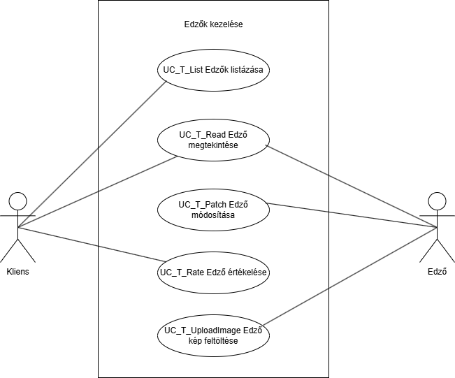
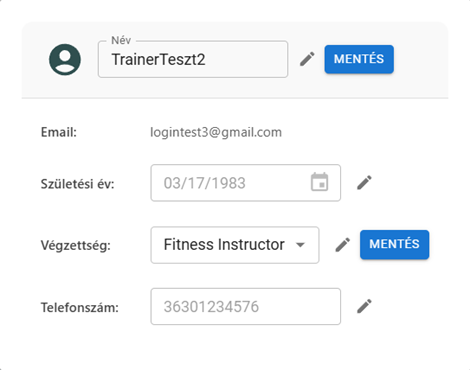
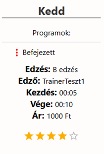

= Edzők kezelése - Funkcionális modell

== Leírás

A rendszer lehetővé teszi az edzők kezelését.

== Használati esetek

=== Használati eset diagram

=== Használati esetek rövid leírása

==== Edzők listázása
[cols="1h,3"]
|===

| Azonosító
| UC_T_List

| Kiváltó esemény
| A felhasználó listázni kívánja az edzőket.

| Felhasználók
| Kliens, Admin

| Elsődleges lefutás
|

A felhasználó a "Trénerek listázása" menüpontra kattint.

A rendszer lekérdezi az összes edző metaadatait (név, születési dátum, nem, végzettség, telefonszám, értékelés).

| Kivételek és alternatívák
| - Ha nincs elérhető edző, a rendszer üres listát ad vissza.

| Utófeltétel
| A rendszer az összes edző adatát megjeleníti.

| Eredmény
| A felhasználó látja az edzők listáját.

| Használati eset realizáció
| Technikai modell
|===

==== Edző megtekintése
[cols="1h,3"]
|===

| Azonosító
| UC_T_Read

| Kiváltó esemény
| A felhasználó meg kívánja tekinteni az edző adatait.

| Felhasználók
| Kliens, Edző

| Elsődleges lefutás
|

A felhasználó kiválasztja az edzőt.

A rendszer lekérdezi és megjeleníti az edző részletes adatait.

Kivételek és alternatívák

| Utófeltétel
| Az edző részletes adatai megjelennek a felületen.

| Eredmény
| A felhasználó látja az edző adatait.

| Használati eset realizáció
| Technikai modell
|===

==== Edző módosítása
[cols="1h,3"]
|===

| Azonosító
| UC_T_Patch

| Kiváltó esemény
| A felhasználó módosítani kívánja az edző metaadatait.

| Felhasználók
| Admin, Edző

| Elsődleges lefutás
|

A felhasználó kiválasztja a módosítandó mezőt (név, születési dátum, végzettség, telefonszám).

A rendszer érvényesíti az adatot.

Az adatok frissülnek az adatbázisban.

| Kivételek és alternatívák
| - Hibás adatbevitel esetén hibaüzenet jelenik meg.

Jogosultság hiányában a módosítás nem hajtható végre.

| Utófeltétel
| Az edző adatai frissültek.

| Eredmény
| A felhasználó látja a módosított adatokat.

| Használati eset realizáció
| Technikai modell
|===

==== Edző értékelése
[cols="1h,3"]
|===

| Azonosító
| UC_T_Rate

| Kiváltó esemény
| A felhasználó értékelést kíván adni egy edzőnek.

| Felhasználók
| Kliens

| Elsődleges lefutás
|

A felhasználó értékelést ad.

Az értékelés bekerül az adatbázisba.

A rendszer újra számolja az edző átlagos értékelését.

| Kivételek és alternatívák
| - Nem létező edző esetén hibaüzenet jelenik meg.

| Utófeltétel
| Az értékelés bekerült a rendszerbe.

| Eredmény
| Az edző átlagos értékelése frissül.

| Használati eset realizáció
| Technikai modell
|===

==== Edző képének feltöltése
[cols="1h,3"]
|===

| Azonosító
| UC_T_UploadImage

| Kiváltó esemény
| A felhasználó képet kíván feltölteni egy edzőhöz.

| Felhasználók
| Edző

| Elsődleges lefutás
|

A felhasználó kiválasztja a képfájlt.

A fájl feltöltésre kerül.

Az edzőhöz mentésre kerül a kép.

| Kivételek és alternatívák
| - Hibás formátum vagy túl nagy fájl esetén hibaüzenet jelenik meg.

| Utófeltétel
| Az edző profilképe frissül.

| Eredmény
| Az edző képe megtekinthető a rendszerben.

| Használati eset realizáció
| Technikai modell
|===

== Jogosultságok

[cols="1,1,1"]
|===
|Használati eset| Jogosultság| Szerepkörök

| Edzők listázása| TRAINER_LIST| Kliens, Admin
| Edző megtekintése| TRAINER_READ| Kliens, Edző
| Edző módosítása| PATCH_TRAINER| Admin, Edző
| Edző értékelése| ADD_RATING| Kliens
| Edző kép feltöltése| UPLOAD_TRAINER_IMAGE| Edző
|===

== Felületi terv

=== Edzők listázása felület

==== Arculat

==== A felületen lévő mezők

[cols="1,1,1,1,1"]
|===
|Név |Típus |Kötelező?| Szerkeszthető?| Megjelenés

|Név |Header oszlopcím| I| N| Találati lista
|Születési dátum |Header oszlopcím| I| N| Találati lista
|Nem |Header oszlopcím| I| N| Találati lista
|Végzettség |Header oszlopcím| I| N| Találati lista
|Telefonszám |Header oszlopcím| I| N| Találati lista
|Értékelés |Header oszlopcím| N| N| Találati lista
|===

==== A felületről elérhető műveletek
[cols="1,1,1"]
|===
|Esemény |Leírás | Jogosultság

|"Edzők" gombra kattintás |Megjelennek az edzők.| TRAINER_LIST
|===

=== Edző módosítása felület

==== A felületen lévő mezők

[cols="1,1,1,1,1"]
|===
|Név |Típus |Kötelező?| Szerkeszthető?| Validáció

|Név |Szöveges input| I| I|
|Születési dátum |Dátum input| I| I| Formátum:YYYY-MM-DD
|Végzettség |Választó| I| I| Csak a Qualification enum értékeit veheti fel
|Telefonszám |Szöveges input| I| I| Telefonszám formátum
|===

==== A felületről elérhető műveletek
[cols="1,1,1,1"]
|===
|Esemény |Leírás | Felület| Jogosultság

|"Mentés" gomb |Mentésre kerülnek a módosított adatok.| Szerkesztő nézet| PATCH_TRAINER
|===

=== Edző értékelése felület

==== A felületen lévő mezők

[cols="1,1,1,1,1"]
|===
|Név |Típus |Kötelező?| Szerkeszthető?| Validáció
|Értékelés |Szöveges input| I| I| 1-5 közötti szám
|===

==== A felületről elérhető műveletek

[cols="1,1,1,1"]
|===
|Esemény |Leírás | Felület| Jogosultság
|Értékelés hozzáadása |A rendszer hozzáadja a megadott értékelést.| Értékelési nézet| ADD_RATING
|===

link:../functional-models.adoc[Vissza]