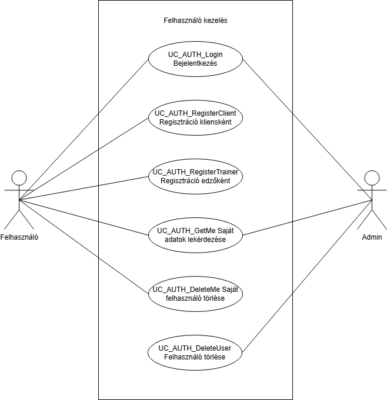

= Hitelesítés és felhasználókezelés - Funkcionális modell

== Leírás
A rendszer lehetővé teszi felhasználók hitelesítését és kezelését.

== Használati esetek

=== Használati eset diagram

=== Bejelentkezés
[cols="1h,3"]
|===
| Azonosító | UC_AUTH_Login
| Kiváltó esemény | Felhasználó be szeretne jelentkezni a rendszerbe
| Felhasználók | Mindenki
| Elsődleges lefutás | 1. A felhasználó megadja email címét és jelszavát

2. A rendszer ellenőrzi a hitelesítési adatokat

3. A rendszer visszaad egy JWT tokent
| Eredmény | A felhasználó bejelentkezett állapotba kerül
|===

=== Felhasználói adatok lekérdezése
[cols="1h,3"]
|===
| Azonosító | UC_AUTH_GetMe
| Kiváltó esemény | Felhasználó meg szeretné tekinteni saját adatait
| Felhasználók | Bejelentkezett felhasználók
| Elsődleges lefutás | 1. A rendszer ellenőrzi a JWT tokent

2. A rendszer visszaadja a felhasználó adatait
| Eredmény | A felhasználó látja saját adatait
|===

=== Saját fiók törlése
[cols="1h,3"]
|===
| Azonosító | UC_AUTH_DeleteMe
| Kiváltó esemény | Felhasználó törölni szeretné saját fiókját
| Felhasználók | Bejelentkezett felhasználók
| Elsődleges lefutás | 1. A rendszer ellenőrzi a JWT tokent

2. A rendszer törli a felhasználó fiókját
| Eredmény | A felhasználó fiókja törlésre kerül
|===

=== Felhasználó törlése admin által
[cols="1h,3"]
|===
| Azonosító | UC_AUTH_DeleteUser
| Kiváltó esemény | Admin törölni szeret egy felhasználót
| Felhasználók | Admin
| Elsődleges lefutás | 1. Az admin kiválasztja a törlendő felhasználót

2. A rendszer törli a felhasználó fiókját
| Eredmény | A kiválasztott felhasználó fiókja törlésre kerül
|===

=== Kliens regisztráció
[cols="1h,3"]
|===
| Azonosító | UC_AUTH_RegisterClient
| Kiváltó esemény | Új felhasználó kliensként szeretne regisztrálni
| Felhasználók | Mindenki
| Elsődleges lefutás | 1. A felhasználó kitölti a regisztrációs űrlapot

2. A rendszer létrehozza az ügyfél fiókot
| Eredmény | Új ügyfél fiók jön létre
|===

=== Edző regisztráció
[cols="1h,3"]
|===
| Azonosító | UC_AUTH_RegisterTrainer
| Kiváltó esemény | Új felhasználó edzőként szeretne regisztrálni
| Felhasználók | Mindenki
| Elsődleges lefutás | 1. A felhasználó kitölti a regisztrációs űrlapot

2. A rendszer létrehozza az edző fiókot
| Eredmény | Új edző fiók jön létre
|===

== Jogosultságok
[cols="1,1,1"]
|===
| Használati eset | Jogosultság | Szerepkörök
| Bejelentkezés | - | Mindenki
| Felhasználói adatok lekérdezése | - | Kliens, Edző, Admin
| Saját fiók törlése | - | Kliens, Edző
| Felhasználó törlése admin által | DELETE_USER | Admin
| Ügyfél regisztráció | - | Mindenki
| Edző regisztráció | - | Mindenki
|===

== Felületi terv

=== Bejelentkezési felület
[cols="1,1,1"]
|===
| Mező | Típus | Kötelező
| Email | Szöveges input | Igen
| Jelszó | Jelszó input | Igen
|===

=== Kliens Regisztrációs felület
[cols="1,1,1"]
|===
| Mező | Típus | Kötelező
| Név | Szöveges input | Igen
| Email | Szöveges input | Igen
| Jelszó | Jelszó input | Igen
| Születési dátum | Dátum input | Igen
| Telefonszám | Szöveges input | Igen
| Nem | Enum | Igen
|===

=== Edző Regisztrációs felület
[cols="1,1,1"]
|===
| Mező | Típus | Kötelező
| Név | Szöveges input | Igen
| Email | Szöveges input | Igen
| Jelszó | Jelszó input | Igen
| Születési dátum | Dátum input | Igen
| Telefonszám | Szöveges input | Igen
| Nem | Enum | Igen
| Végzettség | Enum | Igen
|===

link:../functional-models.adoc[Vissza]