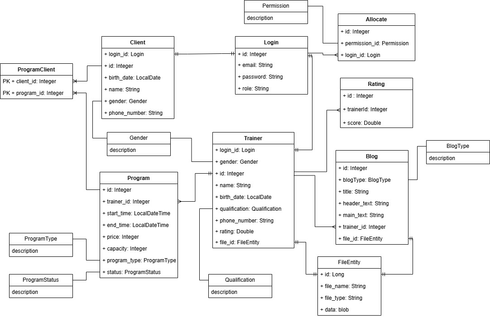

= Adatbázis felépítése

== Az adatbázis struktúrájánk UML diagramja

== Blog típus (BlogType)

[cols="1,3", options="header"]
|===
| Érték | Leírás
| TRAINING | Edzéssel kapcsolatos blogbejegyzés
| DIET | Táplálkozással kapcsolatos blogbejegyzés
|===

== Nem (Gender)

[cols="1,3", options="header"]
|===
| Érték | Leírás
| MALE | Férfi nem
| FEMALE | Női nem
| OTHER | Egyéb nemi identitás
|===

== Jogosultságok (Permission)

[cols="1,3", options="header"]
|===
| Érték | Leírás

| CREATE_PROGRAM | Új program létrehozása
| UPDATE_PROGRAM | Program módosítása
| DELETE_PROGRAM | Program törlése
| LIST_PROGRAMS_CLIENTS | Programra jelentkezett ügyfelek listázása
| PATCH_TRAINER | Saját edzői adatok módosítása
| UPLOAD_TRAINER_IMAGE | Profilkép feltöltése
| UPLOAD_BLOG_IMAGE | Bloghoz kép feltöltése
| CREATE_BLOG | Új blogbejegyzés létrehozása
| UPDATE_BLOG | Blogbejegyzés módosítása
| DELETE_BLOG | Blogbejegyzés törlése

| ADD_RATING | Értékelés hozzáadása
| PATCH_CLIENT | Saját ügyfél adatok módosítása
| JOIN_PROGRAM | Programra jelentkezés
| LEAVE_PROGRAM | Programtól való lejelentkezés
| LIST_CLIENTS_PROGRAMS | Saját programok listázása

| GET_CLIENT | Ügyfél adatainak lekérése
| LIST_CLIENTS | Ügyfelek listázása
| DELETE_USER | Felhasználó törlése
|===

== Program státusz (ProgramStatus)

[cols="1,3", options="header"]
|===
| Érték | Leírás
| UPCOMING | Elkövetkező program (még nem kezdődött el)
| ONGOING | Folyamatban lévő program
| COMPLETED | Befejezett program
|===

== Program típus (ProgramType)

[cols="1,3", options="header"]
|===
| Érték | Leírás
| STRENGTH_TRAINING | Erőnléti edzés
| PILATES | Pilates óra
| CROSSFIT | Crossfit edzés
| B_FIT | B-fit tréning
| SPINNING | Spinning óra
| FUNCTIONAL_TRAINING | Funkcionális edzés
| TRX | TRX edzés
|===

== Képzettség (Qualification)

[cols="1,3", options="header"]
|===
| Érték | Leírás
| PERSONAL_TRAINER | Személyi edző
| FITNESS_INSTRUCTOR | Fitnesz instruktor
| PILATES_INSTRUCTOR | Pilates oktató
| CROSSFIT_COACH | Crossfit edző
| TRX_TRAINER | TRX tréner
| POUND_TRAINER | Pound fitnesz tréner
| OTHER | Egyéb képzettség
|===

link:../technical-models.adoc[Vissza]